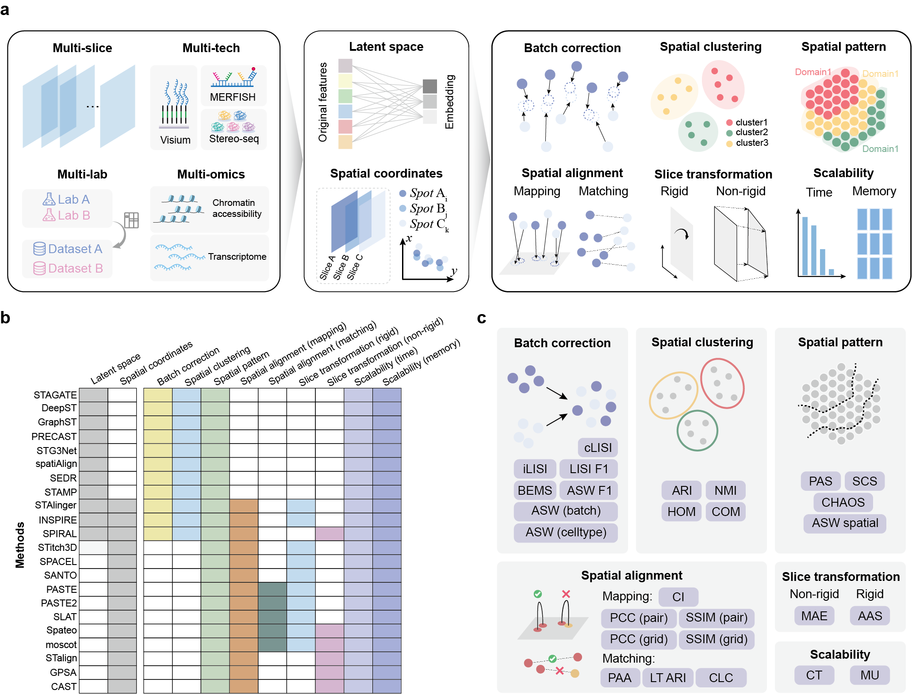

# SOI_Bench
### Charting the Landscape of Spatial Omics Integration: A Comprehensive Benchmarking Study 
### Penghui Yang<sup></sup>, Xiang Zhou*


In this study, we present a comprehensive benchmark to systematically evaluate the performance of existing spatial omics integration methods. By providing a structured comparison and scenario-specific recommendations, our benchmark aims to guide researchers in selecting appropriate methods for spatial omics data analysis, facilitating robust and reproducible integrative studies.



## Requirements and Installation

All method-related Anaconda environment information is stored in the `env.yaml` file, in the [conda_info](conda_info/) .
You can create the environment using the following command:
```
conda env create -f env.yaml 
```

## Methods information
In total, our benchmarking study encompasses 38 real datasets and 43 simulated datasets, systematically assessing a total of 22 integration methods.
| Method   |Version    | GitHub Link |
|------------|-------------|-------------|
| STAGATE  | v1.0.0| [https://github.com/zhanglabtools/STAGATE](https://github.com/zhanglabtools/STAGATE) |
| DeepST   |github version 1daa51| [https://github.com/JiangBioLab/DeepST](https://github.com/JiangBioLab/DeepST) |
| GraphST  |v1.1.1| [https://github.com/JinmiaoChenLab/GraphST](https://github.com/JinmiaoChenLab/GraphST) |
| PRECAST  |v1.6.5| [https://github.com/feiyoung/PRECAST](https://github.com/feiyoung/PRECAST) |
| STG3Net   |github version c94bff4| [https://github.com/wenwenmin/STG3Net](https://github.com/wenwenmin/STG3Net) |
| spatiAlign |v1.0.2| [https://github.com/STOmics/Spatialign](https://github.com/STOmics/Spatialign) |
| SEDR    |github version ef48360| [https://github.com/JinmiaoChenLab/SEDR](https://github.com/JinmiaoChenLab/SEDR) |
| STAMP   |v0.1.3| [https://github.com/JinmiaoChenLab/scTM](https://github.com/JinmiaoChenLab/scTM) |
| STAligner | v1.0.0 | [https://github.com/zhoux85/STAligner](https://github.com/zhoux85/STAligner) |
| INSPIRE  |github version 12b7516| [https://github.com/jiazhao97/INSPIRE](https://github.com/jiazhao97/INSPIRE) |
| SPIRAL   |v1.0| [https://github.com/guott15/SPIRAL](https://github.com/guott15/SPIRAL) |
| STitch3D  | v1.0.3| [https://github.com/YangLabHKUST/STitch3D](https://github.com/YangLabHKUST/STitch3D) |
| SPACEL    |v1.1.8| [https://github.com/QuKunLab/SPACEL](https://github.com/QuKunLab/SPACEL) |
| SANTO     |github version b82a7b9| [https://github.com/leihouyeung/SANTO](https://github.com/leihouyeung/SANTO) |
| PASTE     |v1.4.0| [https://github.com/raphael-group/paste](https://github.com/raphael-group/paste) |
| PASTE2    | v1.0.1| [https://github.com/raphael-group/paste2](https://github.com/raphael-group/paste2) |
| SLAT      | v0.3.0| [https://github.com/gao-lab/SLAT](https://github.com/gao-lab/SLAT) |
| Spateo    |v1.1.0| [https://github.com/aristoteleo/spateo-release](https://github.com/aristoteleo/spateo-release) |
| moscot    |v0.3.5| [https://github.com/theislab/moscot](https://github.com/theislab/moscot) |
| STalign   |v1.0| [https://github.com/JEFworks-Lab/Stalign](https://github.com/JEFworks-Lab/Stalign) |
| GPSA      |v0.8| [https://github.com/andrewcharlesjones/spatial-alignment](https://github.com/andrewcharlesjones/spatial-alignment) |
| CAST      |v0.4| [https://github.com/wanglab-broad/CAST](https://github.com/wanglab-broad/CAST) |


 
## Evaluation Pipeline

All evaluation metrics are located in the `metrics/` folder.
In short, we use [`methods/benchmarking.py`](methods/benchmarking.py) as the core script to call and evaluate methods.  
The benchmarking pipeline can be executed directly from the command line using a conda environment or by specifying the Python interpreter path.  
Below is an example of how to run the script:

```bash
python /path/to/benchmarking.py \
      --input_path /path/to/SD1 \
      --output_path /net/mulan/home/penghuy/benchmark/output/SD1/SLAT \
      --metrics pattern mapping matching r_transform \
      --rigid True \
      --rep 1 \
      --tool_name SLAT \
      --sample 151673_A 151673_B \
      --multi_slice True \
      --cluster_option mclust \
      --subsample False
```

### Benchmarking Script Parameters

| Parameter         | Description |
|------------------|-------------|
| `--input_path`    | Path to the input dataset (e.g., raw spatial transcriptomics data directory). |
| `--output_path`   | Path to save the output results. |
| `--metrics`       | List of evaluation metrics to use. |
| `--rigid`         | Whether to use rigid transformation during alignment. Set to `True` for rigid registration. |
| `--rep`           | Number of repetitions to run the tool for robustness testing. |
| `--tool_name`     | The name of the tool being evaluated (e.g., `SLAT`, `SPIRAL`, `PASTE`). |
| `--sample`        | List of sample names to process (e.g., slice or tissue section IDs). |
| `--multi_slice`   | Whether the input represents multiple slices that need joint alignment (`True` or `False`). |
| `--cluster_option`| Clustering method used after alignment (e.g., `mclust`, `louvain`, `leiden`). |
| `--subsample`     | Whether to perform subsampling on the dataset before alignment. Set to `False` to use the full data. |

## Benchmarking Execution with SLURM

To enable large-scale benchmarking across datasets and tools, we implemented a batch execution framework using SLURM. The workflow is controlled via two YAML files: `metadata.yaml` for dataset-specific settings and `config.yaml` for global and tool-specific configurations.

---

###  1. Dataset Metadata (`metadata.yaml`)

Each dataset folder contains a `metadata.yaml` file that defines dataset-specific properties. Example:

```yaml
sample: ['section2', 'section4']
multi_slice: False
cluster_option: 'mclust'
angle_true:
overlap:
pseudocount:
distortion:
subsample: True
```
-   `sample`: List of section IDs used from the dataset
-   `multi_slice`: Whether multi-slice alignment is required
-   `cluster_option`: Clustering method (e.g.,  `mclust`,  `leiden`,  `louvain`)
-   Other keys like  `angle_true`, `pseudocount`,   `overlap`,  `distortion`  simulation-related parameters that specify how spatial transformations were applied when generating the dataset.

### 2. Batch Configuration (`config.yaml`)

The global configuration is set in  [`config.yaml`](slurm/config.yaml), where you define:
* Input/output paths
* SLURM resource settings
* List of datasets and tools to run
* Tool-specific parameters

```yaml
general:  
  input_path: /path/to/data
  output_base_path: /path/to/output
  benchmarking_py: /path/to/benchmarking.py
  partition: XXX-gpu
  memory: 64
  time: "48:00:00"
  rep: 1

  dataset_names: ['SD1', 'SD2']
  selected_tools: [
    "cast", "deepst", "gpsa", "graphst", "inspire", "paste", "paste2",
    "precast", "santo", "sedr", "slat", "spacel", "spateo_nr", "spateo_r",
    "spatialign", "spiral", "stagate", "stalign", "staligner",
    "stamp", "stg3net", "stitch3d", "moscot_nr", "moscot_r"
  ]

cast:
  metrics: ["pattern", "mapping"]
  rigid: False
  gpus: 1
  cpus: 12
  tool_name: "CAST"
  env_name: "cast"
...
```
-   `dataset_names`: Datasets to process
-   `selected_tools`: List of tool names to evaluate
-   Each tool has its own section specifying metrics, resource needs, conda environment, etc.

### 3. Run the Pipeline

After configuration, launch the benchmarking jobs using [`slurm/run.py`](slurm/run.py):
```
python run.py
```
This will dispatch SLURM jobs to evaluate all selected tools on the specified datasets using the parameters from `config.yaml` and dataset-level `metadata.yaml` files.


## About
Should you have any questions, please feel free to contact the author of the manuscript, Dr. Penghui Yang (penghuy@umich.edu).

## References


